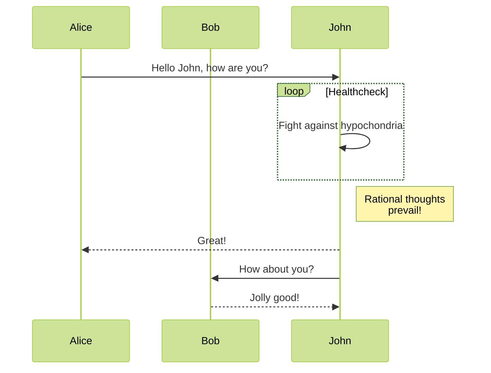
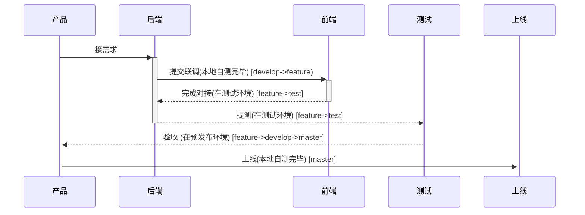
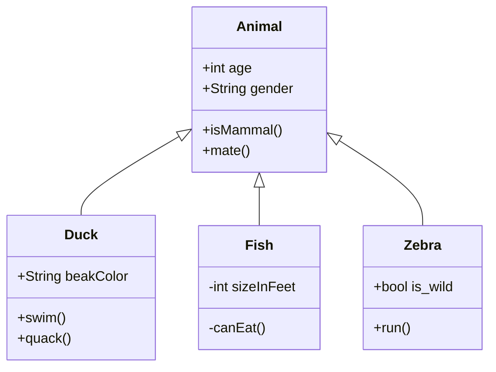

# hugo增加mermaidjs的支持


mermaidjs是一个优秀的绘图的js库 , 支持流程图 , 时序图 , 类图 , 状态图等功能.

把它引入到hugo模板 , 写技术方案特别方便.

## 它的在线编辑器
[https://mermaid-js.github.io/mermaid-live-editor/](https://mermaid-js.github.io/mermaid-live-editor/)

## 步骤
* 修改模板 head.html (底部追加内容)

```html
<!-- file layouts/partials/head.html -->
{{ if .Params.mermaid }}
<script src="https://cdnjs.cloudflare.com/ajax/libs/mermaid/8.9.3/mermaid.min.js" integrity="sha512-kxc8+BGu0/ESUMiK6Q/goKwwcoIoFVcXZ4GwMoGupMA/qTGx19BcNn1uiebOZO5f85ZD0oTdvlRKdeNh3RTnVg==" crossorigin="anonymous" referrerpolicy="no-referrer"></script>
<script>
    // Replace mermaid pre.code to div
    Array.from(document.getElementsByClassName("language-mermaid")).forEach(
        (el) => {
            el.parentElement.outerHTML = `<div class="mermaid">${el.innerText}</div>`;
        }
    );
</script>
<style>
    /* Set svg to center */
    .mermaid svg {
        display: block;
        margin: auto;
    }
</style>
{{ end }}
```

* 文章增加配置
```yml
---
mermaid: true
---
```

### test
```
%%{init: {'theme': 'forest', 'fill': 'white', 'securitylevel': 'loose' } }%%
sequenceDiagram
    participant Alice
    participant Bob
    Alice->>John: Hello John, how are you?
    loop Healthcheck
        John->>John: Fight against hypochondria
    end
    Note right of John: Rational thoughts <br/>prevail!
    John-->>Alice: Great!
    John->>Bob: How about you?
    Bob-->>John: Jolly good!
```



```
graph TD;
    A-->B;
    A-->C;
    B-->D;
    C-->D;
```


```
sequenceDiagram
    产品->>+后端: 接需求  
    后端->>+前端: 提交联调(本地自测完毕) [develop->feature)
    前端-->>-后端: 完成对接(在测试环境) [feature->test]
    后端-->>-测试: 提测(在测试环境) [feature->test]
    测试-->>+产品: 验收 (在预发布环境) [feature->develop->master]
    产品->>+上线: 上线(本地自测完毕) [master]
  
```



```
classDiagram
    Animal <|-- Duck
    Animal <|-- Fish
    Animal <|-- Zebra
    Animal : +int age
    Animal : +String gender
    Animal: +isMammal()
    Animal: +mate()
    class Duck{
      +String beakColor
      +swim()
      +quack()
    }
    class Fish{
      -int sizeInFeet
      -canEat()
    }
    class Zebra{
      +bool is_wild
      +run()
    }
            
```


