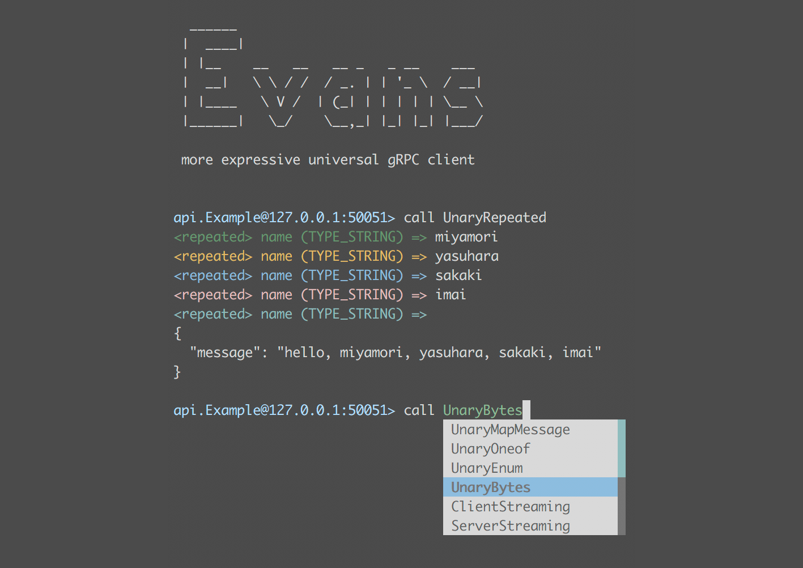

# Mac环境安装grpc的php客户端


```shell
pecl install grpc
pecl install protobuf
php -m | grep grpc
php -m | grep protobuf
```

## 安装超好用的grpc客户端EVANS

[https://github.com/ktr0731/evans](https://github.com/ktr0731/evans)




### 安装
```shell
brew tap ktr0731/evans
brew install evans
```

