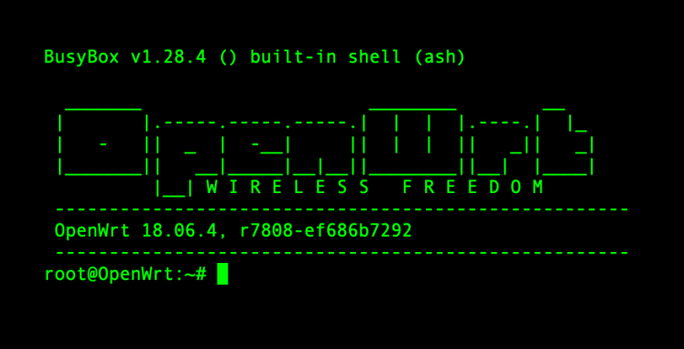
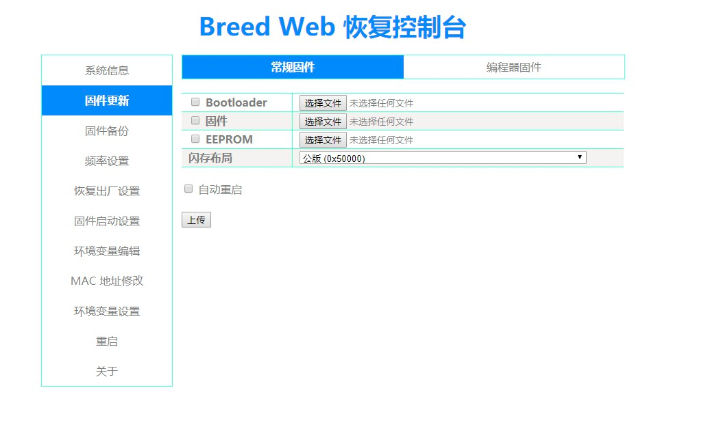
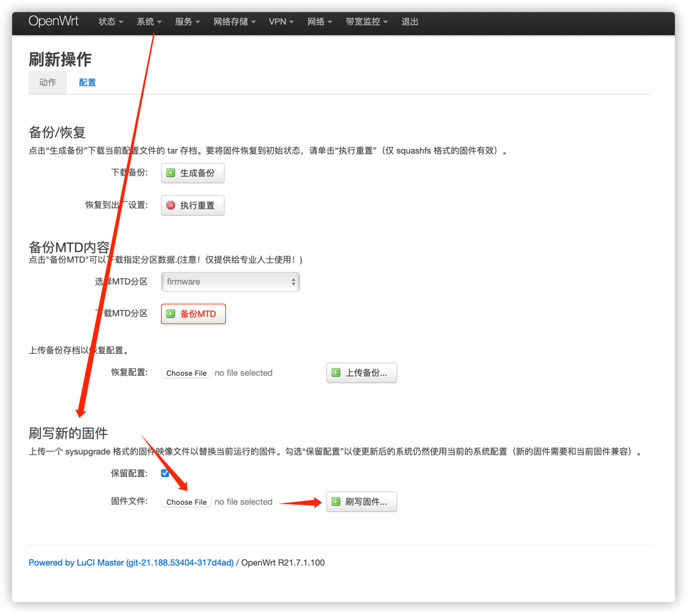

# 刷newifi路由器冲浪


> 找路由器型号的固件 (newifi d2: MediaTek MT7621AT)
> 
> 刷breed (https://breed.hackpascal.net/)
> 
> 刷官方openwrt (https://openwrt.org/toh/hwdata/d-team/d-team_newifi_d2)
> 

为了后面方便使用 , 我直接保存一份我用的文件 (我用的是自定义固件,不是上面那个官方固件,管)

### 不死breed固件

[upload/breed-mt7621-newifi-d2.bin](upload/breed-mt7621-newifi-d2.bin)



### 官方固件的内核版本太低了 , 用网友制作的升级包在管理后台升级下
[upload/openwrt-ramips-mt7621-d-team_newifi-d2-squashfs-sysupgrade.bin](upload/openwrt-ramips-mt7621-d-team_newifi-d2-squashfs-sysupgrade.bin)




## 刷breed
```shell
# 路由器开启了ssh登录
# breed 文件在 upload/breed-mt7621-newifi-d2.bin
# 路由器ip假设为 192.168.1.1

# 上传breed固件到路由器的tmp目录
scp upload/breed-mt7621-newifi-d2.bin root@192.168.1.1:/tmp/
ssh root@192.168.1.1
insmod /tmp/breed-mt7621-newifi-d2.bin ; #ssh 之後應該會no response，這是正常的，因為newifi-d2-jail-breek.ko會停止其它系統功能強制寫入Breed bootloader到Flash，完成寫入後Router會自動重啟，所以等一下就好：D


# 等路由器重启后 , 把路由器断电, 然后按住reset键 通电 , 成功的话会看到所有的led灯快闪4下. 然后连上路由器打开 http://192.168.1.1 进入 Breed Web Interface
```

## 刷openwrt
> 在breed后台 , 选 固件更新  , 使用 upload/openwrt-ramips-mt7621-d-team_newifi-d2-squashfs-sysupgrade.bin


## 冲浪
upload/openwrt-ramips-mt7621-d-team_newifi-d2-squashfs-sysupgrade.bin 这个固件里面已经有ssplus了 , 直接配置就好了.

## 自己搭建一个v2ray
```shell
# 找个新加坡的机器 进入ssh, centos系统为例
wget https://git.io/v2rayinstall.sh;
sh v2rayinstall.sh;
# 选tcp模式
# 端口输入自己看着顺眼的 , 例如 10086 , 提示:如果是云厂商的ecs,可能需要开启下安全组对应的端口,以及注意下防火墙设置
# 不开启ss
# 剩下就等它安装完毕
v2ray info ; # 看服务器配置 , 然后在openwrt的路由器后台配置好对应的ssplus+的v2ray的配置,注意协议,端口,uuid哈
```


