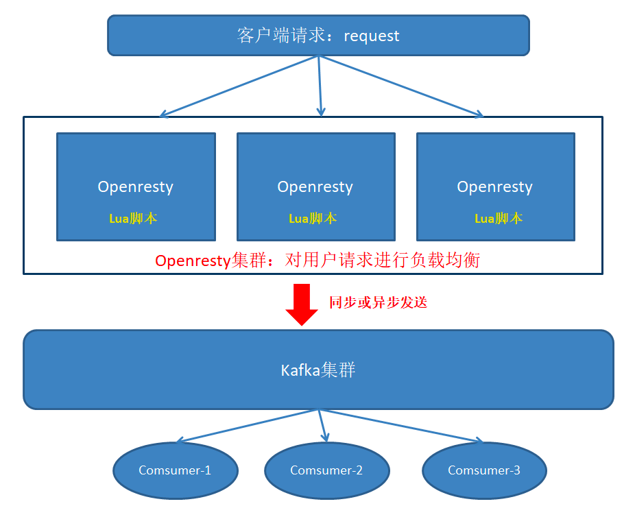

# 部署openresty和kafka的数据采集系统


## 基于Openresty+Lua+Kafka对日志进行实时的采集


### install
```shell
#!/bin/bash

#ubuntu
apt-get update; apt-get install -y gcc g++ libpcre3 libpcre3-dev zlib1g-dev libssl-dev make git wget curl vim

cd /tmp
git clone https://github.com/edenhill/librdkafka
git clone https://github.com/brg-liuwei/ngx_kafka_module
wget http://nginx.org/download/nginx-1.15.5.tar.gz

cd /tmp/librdkafka
./configure; make; sudo make install

tar -zxvf nginx-1.15.5.tar.gz

cd /tmp/nginx-1.15.5
./configure --prefix=/usr/local/nginx_kafka --add-module=/tmp/ngx_kafka_module; make; sudo make install
sudo ln -s /usr/local/nginx_kafka/sbin/nginx /usr/local/bin/nginx-kafka

sudo echo "/usr/local/lib" >> /etc/ld.so.conf
sudo ldconfig
```
