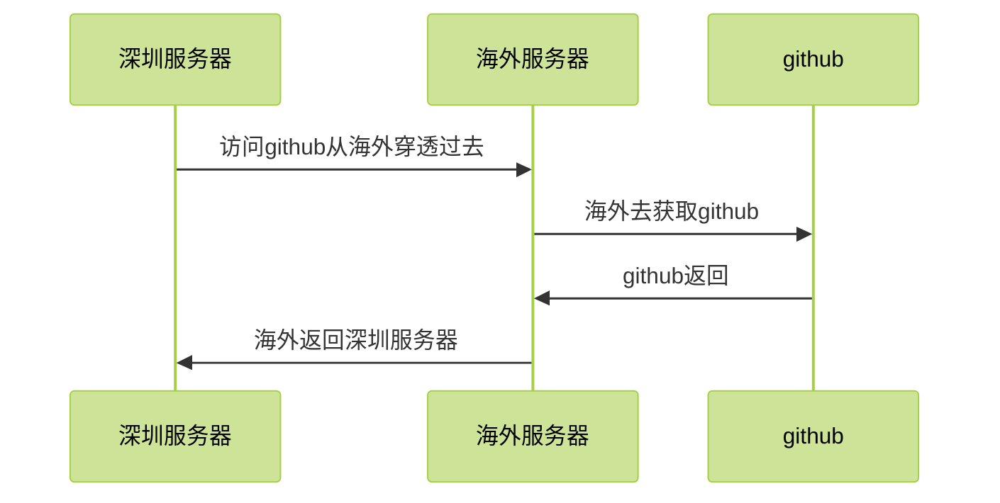

# 用穿透的方式解决国内阿里云访问github不顺畅的问题


# 国内阿里云访问github.com , 经常不顺畅

1. 解决方式 , 在海外买一台服务器
2. 国内的服务直接穿透过去

# 在国内阿里云服务器配置
### ~/.ssh/config
```
Host github.com
    ProxyCommand  ssh 用户名@海外机器IP nc %h %p
```


## 链路



