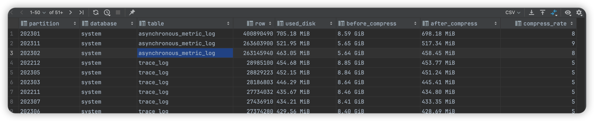

# 清理chickhouse空间


# 清理chickhouse空间
>警告 , 删除数据无法恢复 , 在生产环境使用要想好 !!!!

```sql
-- 查看空间占用
select
    partition,
    database,
    table,
    sum(rows) as row,
    formatReadableSize(sum(bytes_on_disk)) as used_disk,
    formatReadableSize(sum(data_uncompressed_bytes)) as before_compress,
    formatReadableSize(sum(data_compressed_bytes)) as after_compress,
    round(sum(data_compressed_bytes) / sum(data_uncompressed_bytes) * 100, 0) compress_rate
from system.parts
--and database = 'system'
group by table,database,partition
order by row desc;
```

```sql
-- 清理比较大的  注意 , 是删除数据 , 无法恢复
alter table system.asynchronous_metric_log drop partition '202301'; 
-- 上图第一行是占用最多的 , 由于我是在本地开发环境 , 所以数据不重要 , 直接删除
```
